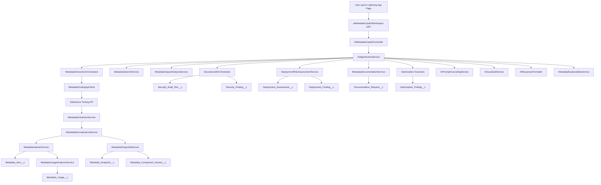

# AI Metadata Copilot for Salesforce Health Cloud

Salesforce-native internal AI copilot project for Health Cloud metadata search, impact analysis, security auditing, deployment comparison, documentation generation, and optimization scanning.

This project is built for:
- Salesforce Admins
- Salesforce Developers
- Solution Architects
- Release Managers

This solution stays inside the Salesforce ecosystem:
- Agentforce
- Prompt Builder
- Apex
- Lightning Web Components
- Tooling API
- Named Credentials
- Einstein Trust Layer

No external AI providers are used.

## 1. Project Goal

This project helps teams ask Salesforce metadata questions in plain English and get grounded, explainable results.

It is designed to answer questions like:
- Where is `Patient_Status__c` used?
- What breaks if I rename `Contact.Email`?
- Which permission sets expose sensitive Health Cloud fields?
- What should I test before deployment?
- Can I explain this Apex class or flow to a beginner teammate?

## 2. Project Root

```text
D:\Salesforce Metadata Navigator MVP
```

Main source folders:
- `force-app/main/default/classes`
- `force-app/main/default/lwc`
- `force-app/main/default/objects`
- `docs`

Main Salesforce DX config:
- [`sfdx-project.json`](D:\Salesforce Metadata Navigator MVP\sfdx-project.json)

## 3. Beginner-Friendly Architecture

Think of this project as 7 connected layers:

1. Tooling API extraction layer
   Reads metadata from Salesforce.

2. Normalization layer
   Converts raw Tooling API responses into a clean internal format.

3. Storage layer
   Stores metadata snapshots, versions, usages, audit findings, deployment findings, and optimization findings.

4. Search and analysis layer
   Runs metadata search, dependency checks, impact analysis, and explainability.

5. Governance layer
   Runs security review, deployment comparison, documentation generation, and optimization scans.

6. AI orchestration layer
   Provides structured Apex actions that Agentforce and Prompt Builder can call.

7. Experience layer
   Shows everything in Lightning through LWC workspaces.

## 4. End-to-End Flow Diagram



## 5. How The Whole Process Works Step by Step

### A. Metadata refresh flow

1. User clicks `Refresh Metadata Core` in the Lightning page.
2. `aiMetadataCopilotWorkspace` calls `AiMetadataCopilotController`.
3. The controller calls `AiAgentActionService`.
4. `AiAgentActionService` calls `MetadataExtractionOrchestrator`.
5. The orchestrator uses `MetadataToolingApiClient` to call the Salesforce Tooling API.
6. `MetadataExtractionService` extracts metadata such as Apex classes, flows, and custom fields.
7. `MetadataNormalizationService` shapes the raw responses into a common internal model.
8. `MetadataSnapshotService` stores the extraction run in snapshot objects.
9. `MetadataIndexerService` stores each metadata item in `Metadata_Item__c`.
10. `MetadataUsageAnalyzerService` scans the indexed metadata and creates `Metadata_Usage__c` records.

### B. Natural language search flow

1. User asks a plain-English question such as `Where is Account.CustomerPriority__c used?`
2. The LWC sends the request to `AiMetadataCopilotController`.
3. `AiAgentActionService` converts the question into a structured search request.
4. `AiPromptGroundingService` prepares grounded context from stored metadata records.
5. `MetadataSearchService` queries metadata and usage records.
6. `MetadataExplainabilityService` prepares the reason behind the answer.
7. `AiResponseFormatter` returns a clean answer with summary, severity, and matched components.

### C. Impact analysis flow

1. User asks what breaks if a field, object, flow, or trigger changes.
2. The controller sends the request to `MetadataImpactAnalysisService`.
3. The service queries matching dependencies from `Metadata_Usage__c`.
4. `RegressionTestRecommendationService` suggests what should be tested.
5. `AiResponseFormatter` returns:
   - impacted components
   - severity
   - recommendations
   - explanation

### D. Security audit flow

1. User asks who can access a sensitive Health Cloud field.
2. `SecurityAuditOrchestrator` runs the security review pipeline.
3. `SensitiveDataClassificationService` determines whether the field is sensitive.
4. `FieldAccessAuditService` checks field-level exposure.
5. `PermissionSetExposureService` checks permission set access.
6. `ProfileExposureService` checks profile access.
7. `SharingRiskService` evaluates sharing-related risk.
8. Findings are stored in:
   - `Security_Audit_Run__c`
   - `Security_Finding__c`

### E. Deployment assistant flow

1. User requests source vs target org comparison.
2. `EnvironmentSnapshotService` prepares source and target snapshot context.
3. `MetadataCompareService` compares metadata states.
4. `DeploymentRiskAssessmentService` calculates deployment risk.
5. `RollbackChecklistService` generates rollback guidance.
6. `RegressionTestRecommendationService` generates testing guidance.
7. Results are stored in:
   - `Deployment_Assessment__c`
   - `Deployment_Finding__c`

### F. Documentation flow

1. User asks to explain a flow, object, or Apex class.
2. `MetadataDocumentationService` gathers grounded details.
3. `ReleaseNoteGenerationService` can build release-note style summaries.
4. Output is stored in `Documentation_Request__c`.

### G. Optimization scan flow

1. User runs the optimization workspace.
2. Scanner services analyze metadata.
3. Findings are stored in `Optimization_Finding__c`.

## 6. Objects Created In This Project

## 6.1 Core MVP Objects

### `Metadata_Item__c`
Purpose:
- Stores one metadata component per row.
- Works as the main searchable metadata index.

Fields:
- `Api_Name__c`
- `Definition__c`
- `Developer_Name__c`
- `Field_API_Name__c`
- `Last_Indexed_On__c`
- `Metadata_Key__c`
- `Metadata_Type__c`
- `Namespace_Prefix__c`
- `Object_API_Name__c`
- `Search_Text__c`
- `Source_Record_Id__c`
- `Status__c`

Use case:
- Search metadata by object, field, or component name.

### `Metadata_Usage__c`
Purpose:
- Stores one dependency or usage relationship per row.

Fields:
- `Context_Snippet__c`
- `Last_Analyzed_On__c`
- `Match_Text__c`
- `Source_Key__c`
- `Source_Metadata__c`
- `Source_Type__c`
- `Target_Key__c`
- `Target_Metadata__c`
- `Target_Type__c`
- `Usage_Key__c`
- `Usage_Type__c`

Use case:
- Find where a field or object is referenced.

### `Impact_Assessment__c`
Purpose:
- Stores impact search input and output summary.

Fields:
- `Impact_Level__c`
- `Match_Count__c`
- `Query_Text__c`
- `Query_Type__c`
- `Summary__c`

Use case:
- Save impact analysis results so they can be reviewed later.

## 6.2 Enterprise Objects

### `Metadata_Snapshot__c`
Purpose:
- Stores one metadata extraction or compare snapshot.

Fields:
- `Completed_On__c`
- `Item_Count__c`
- `Snapshot_Key__c`
- `Snapshot_Type__c`
- `Source_Org_Label__c`
- `Started_On__c`
- `Status__c`
- `Summary__c`
- `Target_Org_Label__c`

Use case:
- Ground AI responses using a specific metadata state.

### `Metadata_Component_Version__c`
Purpose:
- Stores one versioned component row for a snapshot.

Fields:
- `Api_Name__c`
- `Checksum__c`
- `Definition_Snippet__c`
- `Metadata_Key__c`
- `Metadata_Type__c`
- `Snapshot_Key__c`
- `Source_Record_Id__c`
- `Version_Key__c`

Use case:
- Compare component state across environments or across refresh runs.

### `Security_Audit_Run__c`
Purpose:
- Stores one audit execution.

Fields:
- `Completed_On__c`
- `Finding_Count__c`
- `Run_Key__c`
- `Scope_Type__c`
- `Scope_Value__c`
- `Severity__c`
- `Started_On__c`
- `Summary__c`

Use case:
- Track one security review event from request to result.

### `Security_Finding__c`
Purpose:
- Stores one security finding.

Fields:
- `Field_API_Name__c`
- `Finding_Key__c`
- `Finding_Type__c`
- `Object_API_Name__c`
- `Permission_Artifact__c`
- `Recommendation__c`
- `Run_Key__c`
- `Severity__c`
- `Summary__c`

Use case:
- Show which profile, permission set, or rule creates a risk.

### `Deployment_Assessment__c`
Purpose:
- Stores one deployment comparison run.

Use case:
- Save release readiness results between source and target environments.

### `Deployment_Finding__c`
Purpose:
- Stores one deployment warning or difference.

Use case:
- Show missing dependencies, risk items, and rollback notes.

### `Documentation_Request__c`
Purpose:
- Stores one generated documentation request and summary.

Use case:
- Keep grounded technical and business summaries for later reference.

### `Optimization_Finding__c`
Purpose:
- Stores one optimization issue or cleanup recommendation.

Use case:
- Track unused fields, risky triggers, duplicate flows, and other cleanup opportunities.

## 6.3 Custom Metadata Types Created

### `Metadata_Type_Config__mdt`
Use case:
- Controls extraction and processing rules by metadata type.

### `Sensitive_Field_Rule__mdt`
Use case:
- Marks Health Cloud-sensitive fields and objects.

### `Risk_Scoring_Rule__mdt`
Use case:
- Controls severity scoring for impact, security, and deployment logic.

### `Agent_Action_Config__mdt`
Use case:
- Controls which AI actions are enabled and how they are exposed.

### `Environment_Connection__mdt`
Use case:
- Stores allowed source and target environment connection labels.

Note:
- The custom metadata types are included in source.
- Individual custom metadata records should be created per environment based on your team’s rules.

## 7. Apex Classes Created

This section lists the major Apex files in the project and what each one does.

| Class | What It Does | Typical Use Case |
|---|---|---|
| `MetadataToolingApiClient` | Calls the Salesforce Tooling API | Read metadata from the org |
| `MetadataExtractionService` | Extracts metadata records from Tooling API | Read Apex classes, flows, and custom fields |
| `MetadataNormalizationService` | Converts raw extraction output to a common shape | Keep downstream services simple |
| `MetadataIndexerService` | Upserts metadata into `Metadata_Item__c` | Build searchable metadata index |
| `MetadataUsageAnalyzerService` | Builds dependency links in `Metadata_Usage__c` | Find field and object usage |
| `MetadataSearchService` | Searches stored metadata and usage records | Answer metadata search questions |
| `MetadataImpactAnalysisService` | Builds impact summary and severity | Show what breaks if something changes |
| `MetadataExplainabilityService` | Adds reason and traceability to results | Explain why a result was returned |
| `MetadataExtractionOrchestrator` | Coordinates extract, normalize, snapshot, and index flow | Full metadata refresh |
| `MetadataSnapshotService` | Stores snapshot and component version records | Ground AI answers on stored state |
| `MetadataCompareService` | Compares metadata snapshots | Detect differences between environments |
| `EnvironmentSnapshotService` | Builds compare context for environments | Source vs target comparison |
| `DeploymentRiskAssessmentService` | Calculates deployment risk | Predict release risk before deploy |
| `RollbackChecklistService` | Produces rollback checklist guidance | Prepare safer deployment plans |
| `RegressionTestRecommendationService` | Suggests what to test | Release readiness and impact testing |
| `SecurityAuditOrchestrator` | Coordinates security review | Run Health Cloud-sensitive audits |
| `SensitiveDataClassificationService` | Classifies sensitive data targets | PHI-oriented audit rules |
| `FieldAccessAuditService` | Checks field-level exposure | See who can access a field |
| `PermissionSetExposureService` | Checks permission-set exposure | Review permission sets exposing data |
| `ProfileExposureService` | Checks profile exposure | Review profile-based access |
| `SharingRiskService` | Evaluates sharing-related risk | Understand broader access risk |
| `MetadataDocumentationService` | Creates grounded documentation summaries | Explain classes, flows, and objects |
| `ReleaseNoteGenerationService` | Builds release-note style summaries | Prepare release communication |
| `UnusedMetadataScanner` | Finds likely unused metadata | Cleanup candidate detection |
| `DuplicateFlowScanner` | Detects overlapping or duplicate flows | Optimization scan |
| `TriggerRiskScanner` | Finds risky trigger patterns | Release and optimization review |
| `HardcodedIdScanner` | Detects likely hardcoded IDs | Technical debt detection |
| `AiMetadataCopilotModels` | Standard DTOs for requests and responses | Keep controller payloads consistent |
| `AiPromptGroundingService` | Prepares structured grounded context | Safe Agentforce prompt input |
| `AiGuardrailService` | Applies safety rules and response gating | Prevent unsafe or unsupported answers |
| `AiResponseFormatter` | Creates structured responses | Consistent UI and AI outputs |
| `AiAgentActionService` | Main domain action router | Entry point for AI-backed operations |
| `AiMetadataCopilotController` | `@AuraEnabled` UI controller | Called by LWC workspace |
| `MetadataNavigatorController` | Original MVP controller | Supports earlier navigator UI |
| `MetadataRefreshQueueable` | Async metadata refresh job | Long-running refresh support |
| `SecurityAuditQueueable` | Async security audit job | Background audit execution |
| `DeploymentCompareQueueable` | Async compare job | Background deployment comparison |
| `OptimizationScanQueueable` | Async optimization job | Background cleanup analysis |

## 8. Lightning Web Components Created

### `metadataNavigator`
Purpose:
- Original MVP UI for metadata refresh, search, and impact summary.

Use case:
- Good starting point for understanding the project evolution.

### `aiMetadataCopilotWorkspace`
Purpose:
- Enterprise workspace UI with multiple functional tabs.

Tabs:
- Search Workspace
- Impact Analysis Workspace
- Security Audit Workspace
- Deployment Assistant Workspace
- Documentation Generator Workspace
- Optimization Scanner Workspace
- Admin Configuration Workspace

Use case:
- Main Lightning page component for internal users.

## 9. How AI and Agentforce Fit In

The project is designed so Salesforce-native AI can call structured Apex actions instead of guessing.

The intended Agentforce pattern is:

1. User asks a plain-English question.
2. Agentforce topic routes the request.
3. Apex action calls `AiAgentActionService`.
4. The action gathers grounded data from custom objects and internal analyzers.
5. `AiGuardrailService` ensures the answer is safe and grounded.
6. `AiResponseFormatter` produces a structured result.

This means:
- AI answers are based on stored metadata and findings.
- AI is not free-guessing.
- Sensitive Health Cloud data can be protected with controlled grounding.

## 10. Important Setup Notes For New Team Members

These parts are in source control:
- Apex classes
- LWCs
- custom objects
- custom metadata types
- Salesforce DX project files

These parts still require org setup:
- Named Credential and External Credential authentication
- Agentforce topic configuration
- Prompt Builder templates
- Custom metadata records such as sensitive field rules and risk scoring rules
- Permission sets and user assignments

## 11. How To Run The Project In A New Salesforce Sandbox

### Step 1. Clone the repository

```powershell
git clone https://github.com/YOUR_GITHUB_USERNAME/ai-metadata-copilot-salesforce-health-cloud.git
cd "ai-metadata-copilot-salesforce-health-cloud"
```

### Step 2. Authorize the Salesforce org

```powershell
sf org login web --alias health-mvp-dev --instance-url https://login.salesforce.com
```

### Step 3. Deploy metadata

```powershell
sf project deploy start --target-org health-mvp-dev --source-dir force-app
```

### Step 4. Configure org-side items

Set up:
- Named Credential
- External Credential
- Agentforce assets
- Prompt Builder assets
- custom metadata records

### Step 5. Add the Lightning page

1. Open `Setup`
2. Search `Lightning App Builder`
3. Create or open an `App Page`
4. Drag `aiMetadataCopilotWorkspace` onto the page
5. Save and Activate

### Step 6. Test the app

Run:
- metadata refresh
- search
- impact analysis
- security audit
- optimization scan

## 12. How To Understand The Project As A Beginner

If you are new to Salesforce development, read the project in this order:

1. [`README.md`](D:\Salesforce Metadata Navigator MVP\README.md)
2. [`MetadataToolingApiClient.cls`](D:\Salesforce Metadata Navigator MVP\force-app\main\default\classes\MetadataToolingApiClient.cls)
3. [`MetadataExtractionService.cls`](D:\Salesforce Metadata Navigator MVP\force-app\main\default\classes\MetadataExtractionService.cls)
4. [`MetadataIndexerService.cls`](D:\Salesforce Metadata Navigator MVP\force-app\main\default\classes\MetadataIndexerService.cls)
5. [`MetadataUsageAnalyzerService.cls`](D:\Salesforce Metadata Navigator MVP\force-app\main\default\classes\MetadataUsageAnalyzerService.cls)
6. [`MetadataSearchService.cls`](D:\Salesforce Metadata Navigator MVP\force-app\main\default\classes\MetadataSearchService.cls)
7. [`MetadataImpactAnalysisService.cls`](D:\Salesforce Metadata Navigator MVP\force-app\main\default\classes\MetadataImpactAnalysisService.cls)
8. [`AiAgentActionService.cls`](D:\Salesforce Metadata Navigator MVP\force-app\main\default\classes\AiAgentActionService.cls)
9. [`AiMetadataCopilotController.cls`](D:\Salesforce Metadata Navigator MVP\force-app\main\default\classes\AiMetadataCopilotController.cls)
10. [`aiMetadataCopilotWorkspace`](D:\Salesforce Metadata Navigator MVP\force-app\main\default\lwc\aiMetadataCopilotWorkspace)

Simple mental model:
- `MetadataToolingApiClient` fetches data.
- extraction services shape data.
- indexer stores data.
- analyzer connects dependencies.
- search and impact services answer questions.
- AI action service exposes the intelligence cleanly.
- LWC shows everything to users.

## 13. What Is Already Working

Working project areas:
- metadata extraction
- metadata indexing
- metadata usage mapping
- object usage search
- field usage search
- impact summaries
- enterprise workspace foundation
- security/deployment/documentation/optimization service scaffolding
- Salesforce deployment-ready source format

## 14. Current Known Limitations

- Prompt Builder assets are part of the target architecture but still require org-side setup.
- Agentforce topics and actions still require configuration in the org.
- Named Credential and authentication setup is org-specific.
- The advanced enterprise services are a strong foundation, but not every roadmap item has been fully matured.
- Test classes still need to be expanded for production-grade confidence.

## 15. GitHub Publishing Workflow

Recommended Git workflow:

```powershell
git checkout main
git pull
git checkout -b feature/your-change
git add .
git commit -m "Describe your change"
git push -u origin feature/your-change
```

Then open a pull request on GitHub.

For teammates:
- clone the repo if they want to contribute to the same shared repository
- fork the repo if they want a separate personal copy

## 16. Final Summary

This project is a Salesforce-native metadata intelligence and AI copilot foundation for Health Cloud.

In simple terms:
- it reads metadata
- stores metadata
- connects dependencies
- answers questions
- explains risk
- supports security review
- supports deployment review
- prepares the path for Salesforce-native AI experiences

It is designed so a beginner can follow it, while still being structured enough for enterprise growth.
