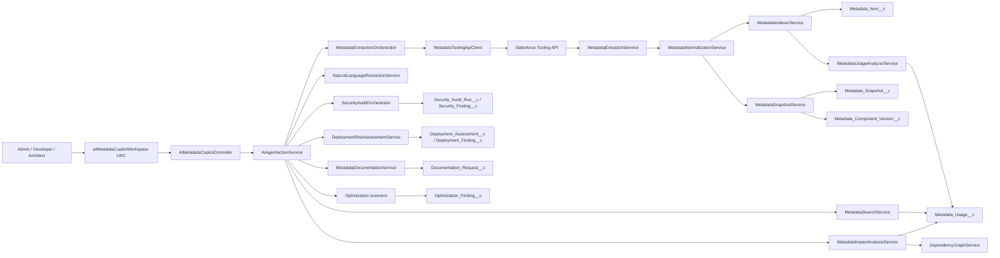
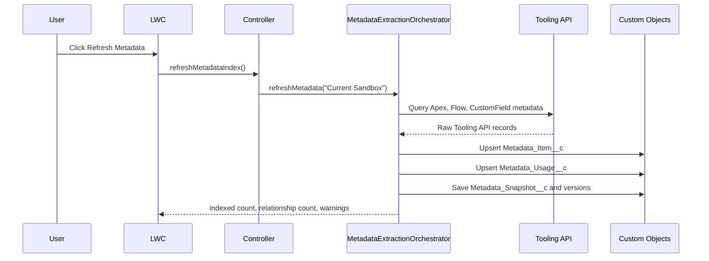
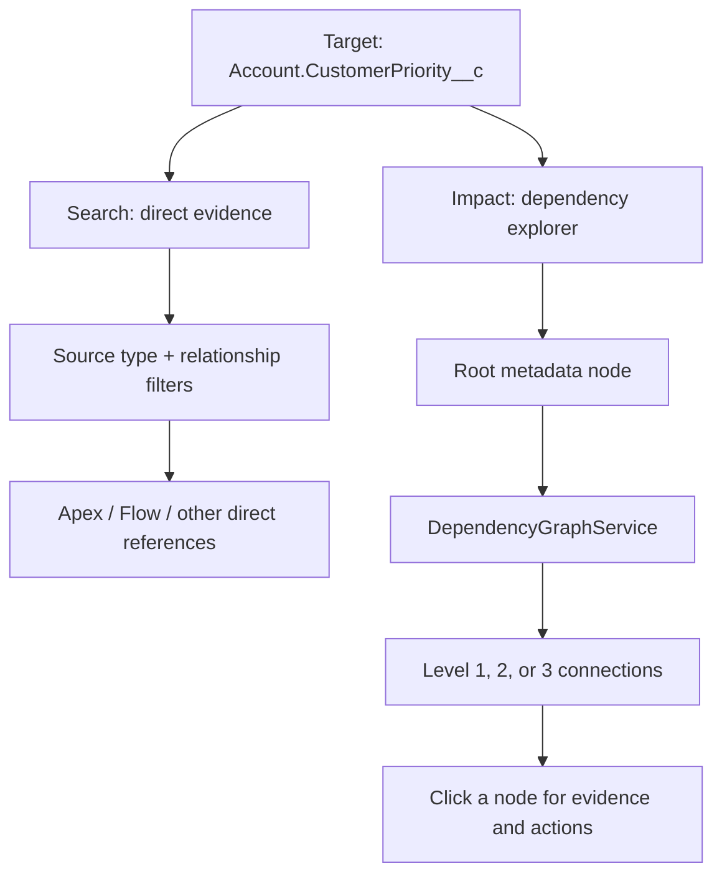
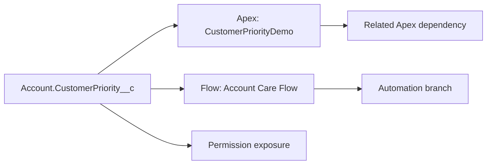
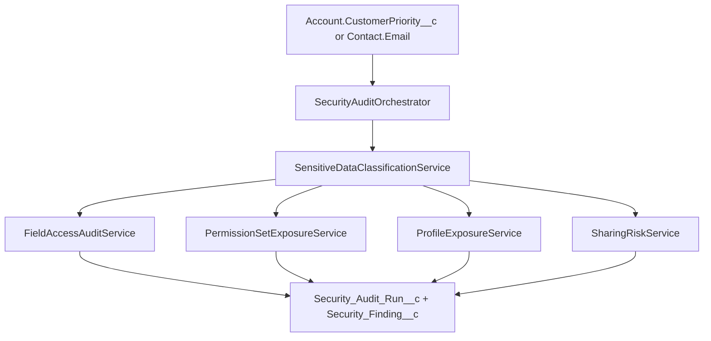
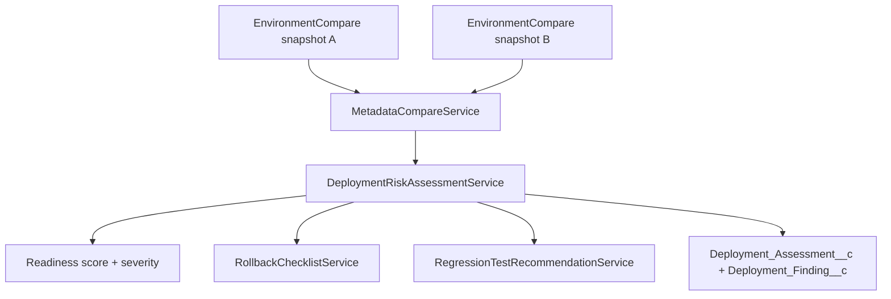

# AI Metadata Copilot for Salesforce Health Cloud


Salesforce-native metadata intelligence for admins, developers, architects, and release managers working in Health Cloud-style orgs.

The copilot indexes Salesforce metadata, maps usage relationships, and gives grounded answers for search, impact analysis, security exposure, deployment readiness, documentation, and optimization checks. It runs inside Salesforce with Apex, Lightning Web Components, custom objects, custom metadata, and the Tooling API.

> [!NOTE]
> This project does not deploy changes from the Deploy tab. The Deploy tab compares metadata snapshots and produces readiness, findings, rollback guidance, and test guidance before a release.

## Contents

- [Features](#features)
- [Architecture](#architecture)
- [How the flows work](#how-the-flows-work)
- [Project structure](#project-structure)
- [Core Apex classes](#core-apex-classes)
- [Custom objects and fields](#custom-objects-and-fields)
- [Lightning components](#lightning-components)
- [Latest regression fixes and test assets](#latest-regression-fixes-and-test-assets)
- [Install in another Salesforce org](#install-in-another-salesforce-org)
- [Configure the org](#configure-the-org)
- [Run and test](#run-and-test)
- [Troubleshooting](#troubleshooting)

## Features

- **Metadata refresh**: extracts supported metadata through Tooling API and stores it in a searchable Salesforce index.
- **Search**: finds direct references with source-type and relationship filters. It answers: "Where is this used?"
- **Impact analysis**: builds a depth-limited dependency graph. It answers: "What is connected to this, and what should I inspect next?"
- **Security audit**: checks sensitive field exposure across field permissions, permission sets, profiles, and sharing patterns.
- **Deploy assistant**: compares environment snapshots and creates release-readiness findings.
- **Documentation generator**: builds technical and business summaries from indexed metadata.
- **Optimization scan**: flags unused metadata, duplicate flows, hardcoded IDs, trigger risks, and cleanup opportunities.
- **Admin tools**: refreshes metadata and checks index health from the main LWC workspace.

## Architecture



### Design principles

- **Grounded answers first**: responses come from stored metadata records and usage relationships.
- **Salesforce-native runtime**: no external app server is required.
- **Explainability by default**: results include summaries, context snippets, severity, and recommendations.
- **Release safety**: impact, deployment, rollback, and regression test guidance are first-class outputs.
- **Health Cloud-aware security**: sensitive field rules are configurable through custom metadata.

### Beginner map: which part does what?

| You use this in the UI | The LWC calls | The Apex service does the work | Main records used |
| --- | --- | --- | --- |
| Search | `searchMetadataDirectFiltered` or `searchMetadata` | `MetadataSearchService` | `Metadata_Usage__c`, `Metadata_Item__c` |
| Impact | `analyzeImpactDirect` or `analyzeImpact` | `MetadataImpactAnalysisService` and `DependencyGraphService` | `Metadata_Usage__c`, `Impact_Assessment__c` |
| Security | `runSecurityAuditDirect` | `SecurityAuditOrchestrator` and exposure services | `Sensitive_Field_Rule__mdt`, security result objects |
| Deploy | `captureDeploymentSnapshot`, `captureAndCompareDeployment`, `compareEnvironments` | `DeploymentWorkspaceService` and `DeploymentRiskAssessmentService` | `Metadata_Snapshot__c`, `Metadata_Component_Version__c`, deployment result objects |
| Optimize | `runOptimizationScan` | scanner classes such as `UnusedMetadataScanner` and `HardcodedIdScanner` | `Optimization_Finding__c` |
| Admin | `refreshMetadataIndex`, `checkHealth` | `MetadataExtractionOrchestrator` and `MetadataHealthService` | index, usage, snapshot, and health counts |

## How the flows work

### Metadata refresh



### Search and impact are intentionally different



Search is a focused list. It returns direct rows from `Metadata_Usage__c` and lets the user filter by source type (`ApexClass`, `Flow`, `CustomField`) and relationship (`UsesField`, `UsesObject`, `InvokesFlow`, or `HasPermission`).

Impact uses the same indexed evidence as its starting point, then traverses inbound and outbound relationships up to three levels. The graph prevents cycles, removes duplicate edges, and shows the relationship direction, confidence, evidence snippet, and metadata category. Click **Open in Search** to inspect the direct reference, or **Expand from here** to make the selected node the new graph root.



The small guide beside each tab uses plain language: **Search finds references. Impact explores connections.** The graph legend distinguishes structured dependencies, indexed text matches, and inferred relationships. The current repository primarily indexes text-match relationships for Apex, Flow, and CustomField records; unsupported metadata types are shown as coverage gaps instead of being presented as complete.

### Security audit



### Deployment comparison



> [!IMPORTANT]
> The Deploy tab needs two `EnvironmentCompare` snapshots. If both snapshots are taken after the same metadata state, readiness can be `100` with `0` findings because there is no delta to report.

## Project structure

```text
force-app/main/default
|-- classes/              Apex services, controllers, queueables, tests
|-- customMetadata/       Action, environment, risk, and sensitive field records
|-- lwc/                  Metadata Copilot Lightning workspaces
|-- objects/              Custom objects, custom metadata types, and fields
`-- permissionsets/       AI_Metadata_Copilot_User permission set
```

Key files:

| Path | Purpose |
| --- | --- |
| `sfdx-project.json` | Salesforce DX project config. Uses API version `66.0`. |
| `force-app/main/default/lwc/aiMetadataCopilotWorkspace` | Main multi-tab Metadata Copilot UI. |
| `force-app/main/default/classes/AiMetadataCopilotController.cls` | Main `@AuraEnabled` controller called by LWC. |
| `force-app/main/default/classes/AiAgentActionService.cls` | Domain action router for search, impact, security, deployment, docs, and optimization. |
| `force-app/main/default/permissionsets/AI_Metadata_Copilot_User.permissionset-meta.xml` | Baseline permission set for users of the workspace. |
| `scripts/cleanup-storage.apex` | Utility script for cleaning retained generated records if storage is constrained. |

## Core Apex classes

### UI and action layer

| Class | What it does | Important functions |
| --- | --- | --- |
| `AiMetadataCopilotController` | LWC-facing Apex controller. | Search, filtered Search, Impact, dependency graph, security, deployment, documentation, optimization, refresh, and health endpoints |
| `AiAgentActionService` | Routes structured requests to the right domain service and formats responses. | `searchMetadata`, `analyzeImpact`, `runSecurityAudit`, `compareEnvironments`, `generateDocumentation`, `runOptimizationScan` |
| `AiMetadataCopilotModels` | Request/response DTOs used by LWC, Apex, and Agentforce actions. | `MetadataSearchResponse`, `ImpactAnalysisResponse`, `DependencyGraphResponse`, `SecurityAuditResponse`, `DeploymentCompareResponse` |
| `AiPromptGroundingService` | Converts stored metadata rows into UI-safe grounded components. | `buildGroundedComponents`, `buildSecurityGroundingSummary` |
| `AiGuardrailService` | Enforces read-only and safe prompt behavior. | Used before search and action execution |
| `AiResponseFormatter` | Produces scores and severity labels. | `toScore`, `severityFromScore` |
| `NaturalLanguageResolutionService` | Resolves labels and natural-language prompts against the indexed catalog. | Exact API, label, object, field, and ambiguity resolution |
| `MetadataNaturalLanguageAction` | Exposes catalog resolution as an invocable Apex action for Agentforce or Flow. | `resolve` |

### Metadata extraction and indexing

| Class | What it does | Important functions |
| --- | --- | --- |
| `MetadataToolingApiClient` | Calls Salesforce Tooling API using the configured named credential. | `runQuery` |
| `MetadataExtractionService` | Extracts Apex classes, flows, and custom fields into normalized extraction items. | `extractAllSupportedMetadata` |
| `MetadataNormalizationService` | Parses user prompts and normalizes metadata terms. | `normalizeSearchRequest`, `normalizeImpactRequest` |
| `MetadataExtractionOrchestrator` | Coordinates refresh, snapshot, indexing, usage analysis, retention cleanup. | `refreshMetadata` |
| `MetadataIndexerService` | Upserts extracted components into `Metadata_Item__c`. | Indexing methods for metadata items |
| `MetadataUsageAnalyzerService` | Scans indexed definitions for field/object usage and stores relationships. | `analyzeAndStoreUsage` |
| `MetadataSnapshotService` | Saves metadata snapshots and component versions. | `saveSnapshot`, `getLatestSnapshot`, `getSnapshotVersions` |
| `MetadataRetentionService` | Guards optional writes and cleanup when org storage is constrained. | Retention checks and cleanup helpers |
| `MetadataStorageUtility` | Detects storage-limit DML errors. | Storage exception helpers |

### Search and impact

| Class | What it does | Important functions |
| --- | --- | --- |
| `MetadataSearchService` | Searches usage relationships and applies source-type and relationship filters. | `searchFieldUsage`, `searchObjectUsage`, detailed filtered search methods |
| `MetadataImpactAnalysisService` | Converts direct usage rows into impact level, summary, and persisted assessment. | `analyzeFieldUsage`, `analyzeObjectUsage` |
| `DependencyGraphService` | Traverses indexed usage edges in both directions with depth and cycle protection. | `buildForQuery`, `build` |
| `MetadataExplainabilityService` | Builds explanations, recommendations, and impact guidance. | Search and impact recommendation builders |
| `RegressionTestRecommendationService` | Suggests test areas from impact or deployment findings. | `buildImpactAreas`, `buildChecklistFromFindings` |

### Security

| Class | What it does | Important functions |
| --- | --- | --- |
| `SecurityAuditOrchestrator` | Parses scope, runs all exposure checks, persists audit results. | `runAudit` |
| `SensitiveDataClassificationService` | Resolves sensitive targets from `Sensitive_Field_Rule__mdt` or indexed fields. | `getSensitiveTargets` |
| `FieldAccessAuditService` | Audits field permissions and direct field exposure. | Field access finding generation |
| `PermissionSetExposureService` | Finds permission sets exposing the requested sensitive field. | Permission-set finding generation |
| `ProfileExposureService` | Finds profiles exposing the requested sensitive field. | Profile finding generation |
| `SharingRiskService` | Adds org-sharing style exposure findings. | Sharing risk finding generation |
| `SecurityAuditQueueable` | Runs security audits asynchronously. | `execute` |

### Deployment, documentation, and optimization

| Class | What it does | Important functions |
| --- | --- | --- |
| `EnvironmentSnapshotService` | Captures current metadata as `EnvironmentCompare` snapshots. | `captureCurrentEnvironment` |
| `DeploymentWorkspaceService` | Provides baseline capture, current capture, snapshot listing, and compare actions for the Deploy tab. | `getState`, `captureSnapshot`, `captureAndCompare` |
| `MetadataCompareService` | Compares two snapshot keys by checksum and presence/absence. | `compareSnapshots` |
| `DeploymentRiskAssessmentService` | Calculates readiness, persists assessment and findings. | `assess` |
| `RollbackChecklistService` | Builds rollback checklist from deployment findings. | `buildChecklist` |
| `DeploymentCompareQueueable` | Runs deployment compare asynchronously. | `execute` |
| `MetadataDocumentationService` | Creates grounded technical and business summaries. | Documentation generation methods |
| `ReleaseNoteGenerationService` | Creates release-note style summaries. | Release note helpers |
| `UnusedMetadataScanner` | Finds likely unused metadata. | Scanner methods |
| `DuplicateFlowScanner` | Detects duplicate or overlapping flows. | Scanner methods |
| `HardcodedIdScanner` | Detects hardcoded Salesforce IDs. | Scanner methods |
| `TriggerRiskScanner` | Detects risky trigger patterns. | Scanner methods |
| `OptimizationScanQueueable` | Runs optimization scans asynchronously. | `execute` |

### Test and demo classes

| Class | What it does |
| --- | --- |
| `AiMetadataCopilotControllerTest` | Main regression suite for search, impact, security, deployment, docs, optimization, and refresh behavior. |
| `MetadataCopilotTestDataFactory` | Builds repeatable test records for metadata items, usage, snapshots, security, and deployment. |
| `ContactTestingField2UsageDemo` | Demo class that references `Contact.Testing_Field_2__c` so Search and Impact can find a real Contact field usage. |

## Custom objects and fields

### Metadata index

| Object | Role | Important fields |
| --- | --- | --- |
| `Metadata_Item__c` | One row per indexed metadata component. | `Metadata_Key__c`, `Metadata_Type__c`, `Api_Name__c`, `Object_API_Name__c`, `Field_API_Name__c`, `Definition__c`, `Search_Text__c`, `Last_Indexed_On__c` |
| `Metadata_Usage__c` | One row per usage relationship and one graph edge. `Source_Key__c` points to the component doing the using; `Target_Key__c` points to the field or object being used. | `Usage_Key__c`, `Source_Type__c`, `Target_Type__c`, `Usage_Type__c`, `Match_Text__c`, `Context_Snippet__c` |
| `Metadata_Snapshot__c` | One refresh or environment comparison snapshot. | `Snapshot_Key__c`, `Snapshot_Type__c`, `Source_Org_Label__c`, `Target_Org_Label__c`, `Item_Count__c`, `Status__c` |
| `Metadata_Component_Version__c` | Versioned component row for a snapshot. | `Version_Key__c`, `Snapshot_Key__c`, `Metadata_Key__c`, `Checksum__c`, `Definition_Snippet__c` |

### Results and governance

| Object | Role | Important fields |
| --- | --- | --- |
| `Impact_Assessment__c` | Stores impact analysis results. | `Query_Text__c`, `Query_Type__c`, `Impact_Level__c`, `Match_Count__c`, `Summary__c` |
| `Security_Audit_Run__c` | Stores one security audit execution. | `Run_Key__c`, `Scope_Type__c`, `Scope_Value__c`, `Finding_Count__c`, `Severity__c`, `Summary__c` |
| `Security_Finding__c` | Stores one security finding. | `Finding_Key__c`, `Run_Key__c`, `Object_API_Name__c`, `Field_API_Name__c`, `Permission_Artifact__c`, `Severity__c` |
| `Deployment_Assessment__c` | Stores one deployment compare result. | `Assessment_Key__c`, `Source_Environment__c`, `Target_Environment__c`, `Readiness_Score__c`, `Rollback_Checklist__c`, `Test_Checklist__c` |
| `Deployment_Finding__c` | Stores one deployment difference or warning. | `Finding_Key__c`, `Assessment_Key__c`, `Finding_Type__c`, `Metadata_Key__c`, `Severity__c`, `Recommendation__c` |
| `Documentation_Request__c` | Stores generated documentation. | `Request_Key__c`, `Metadata_Key__c`, `Request_Type__c`, `Technical_Summary__c`, `Business_Summary__c` |
| `Optimization_Finding__c` | Stores optimization scan findings. | `Finding_Key__c`, `Finding_Type__c`, `Metadata_Key__c`, `Severity__c`, `Status__c`, `Recommendation__c` |

### Custom metadata types

| Type | Role |
| --- | --- |
| `Agent_Action_Config__mdt` | Defines enabled action names, topic names, prompt template names, and guardrail notes. |
| `Environment_Connection__mdt` | Stores environment labels and optional named credential references. |
| `Metadata_Type_Config__mdt` | Controls which metadata types are extractable and how they are queried. |
| `Risk_Scoring_Rule__mdt` | Stores severity and weighting rules. |
| `Sensitive_Field_Rule__mdt` | Marks sensitive object/field combinations such as `Account.CustomerPriority__c`. |

### Standard object test field

| Field | Type | Why it exists |
| --- | --- | --- |
| `Contact.Testing_Field_2__c` | Text(100) | Test field created to validate Search, Impact, and Deploy workflows on a real standard object custom field. |

## Lightning components

| Component | Role |
| --- | --- |
| `aiMetadataCopilotWorkspace` | Main UI with Search, Impact, Security, Deploy, Optimize, and Admin tabs. Uses direct Apex methods for precise API-name searches. |
| `metadataNavigator` | Earlier MVP UI for metadata search and impact exploration. Kept for compatibility and project history. |

## Latest regression fixes and test assets

The latest implementation fixed direct API-name handling for qualified field names such as `Account.CustomerPriority__c`.

What changed:

- Direct Search and Impact calls now use primitive Apex entry points: `searchMetadataDirect` and `analyzeImpactDirect`.
- Direct Security calls use `runSecurityAuditDirect`.
- Direct methods trim visible UI input before invoking the service layer.
- Qualified field search stays scoped to the requested object and no longer broadens to same-named fields on other objects.
- Security findings normalize `Object.Field__c` into `objectApiName = Object` and `fieldApiName = Field__c`.
- `SensitiveDataClassificationService` no longer expands unresolved field-only requests to every baseline object.
- `Contact.Testing_Field_2__c` and `ContactTestingField2UsageDemo` provide a real test scenario for Contact field usage.
- Search now supports source-type and relationship filters and shows indexed coverage.
- Impact now returns `DependencyGraphResponse` data with root nodes, typed edges, depth, direction, confidence, and warnings.
- `DependencyGraphService` traverses the indexed relationship graph in both directions, stops at three levels, and prevents duplicate or cyclic traversal.
- The Deploy workspace captures named baselines, captures current state, and compares explicitly selected snapshot keys.

Useful manual test terms:

| Feature | Input | Expected result |
| --- | --- | --- |
| Search | `Account.CustomerPriority__c` | Finds grounded Account field usage. |
| Impact | `Account.CustomerPriority__c` | Finds impacted Apex dependencies. |
| Security | `Account.CustomerPriority__c` | Returns only findings scoped to Account Customer Priority. |
| Search | `Contact.Testing_Field_2__c` | Finds `ContactTestingField2UsageDemo`. |
| Impact | `Contact.Testing_Field_2__c` | Shows `ContactTestingField2UsageDemo` as an impacted component. |

### Test the dependency graph

1. Open **Impact**.
2. Select **Direct API Name** and enter `Account.CustomerPriority__c` or `Contact.Testing_Field_2__c`.
3. Click **Analyze**.
4. Select `1`, `2`, or `3` dependency levels.
5. Choose **Both directions**, **Referenced by**, or **Depends on**.
6. Click a graph node to open its evidence panel.
7. Use **Open in Search** for direct references or **Expand from here** to make that node the graph root.

The current indexed catalog contains `ApexClass`, `Flow`, and `CustomField` records. The graph warns when coverage is incomplete; it does not claim that unsupported metadata types were searched.

## Install in another Salesforce org

### Prerequisites

- Git
- Salesforce CLI (`sf`)
- A Salesforce sandbox, scratch org, or developer org
- Admin access to configure connected app / named credential details
- My Domain enabled for Lightning pages and LWCs

> [!TIP]
> In `cmd.exe`, use `cd /d` when switching drives on Windows:
>
> ```cmd
> cd /d "D:\Salesforce Metadata Navigator MVP"
> ```

### 1. Clone the repository

```bash
git clone https://github.com/KrishnenduBose-github/ai-metadata-copilot-salesforce-health-cloud.git
cd ai-metadata-copilot-salesforce-health-cloud
```

### 2. Log in to the target org

For a sandbox:

```bash
sf org login web --alias metadata-copilot-target --instance-url https://test.salesforce.com
```

For a production or developer org:

```bash
sf org login web --alias metadata-copilot-target --instance-url https://login.salesforce.com
```

### 3. Deploy the project source

```bash
sf project deploy start --target-org metadata-copilot-target --source-dir force-app --wait 30
```

For a production org, validate with tests first and then deploy the validated source:

```bash
sf project deploy start --target-org metadata-copilot-target --source-dir force-app --dry-run --test-level RunSpecifiedTests --tests AiMetadataCopilotControllerTest --wait 30
sf project deploy start --target-org metadata-copilot-target --source-dir force-app --test-level RunLocalTests --wait 30
```

### 4. Assign the permission set

```bash
sf org assign permset --target-org metadata-copilot-target --name AI_Metadata_Copilot_User
```

> [!IMPORTANT]
> The included permission set is a starting point. For production use, review object CRUD/FLS, Apex class access, and tab/page access with your security team.

### 5. Configure Tooling API access

Create the org-side authentication used by `MetadataToolingApiClient`.

Recommended setup:

1. In Salesforce Setup, create or verify a connected app / external credential approach that can call back into the same org.
2. Create a Named Credential named `SalesforceTooling`.
3. Point it to the org base URL.
4. Ensure the running user has permission to query Tooling API objects such as `ApexClass`, `Flow`, and `CustomField`.

> [!NOTE]
> If the named credential is missing, refresh and snapshot capture can fail with a message similar to `Tooling API callout failed. Verify the Named Credential SalesforceTooling is configured.`

The Named Credential is used by `MetadataToolingApiClient` for callouts to the org Tooling API. It is not included as a secret in this repository, so every destination org must configure its own authentication. Never commit passwords, client secrets, session IDs, or tokens.

### 6. Add the Lightning component to a page

1. Open Salesforce Setup.
2. Go to **Lightning App Builder**.
3. Create or edit an App Page.
4. Drag `aiMetadataCopilotWorkspace` onto the page.
5. Save and activate the page for the right app/profile.

### 7. Initialize the metadata index

In the Metadata Copilot page:

1. Open the **Admin** tab.
2. Click **Refresh Metadata**.
3. Wait for success.
4. Use **Check Health** to confirm indexed items and relationships.

### Moving the solution from one org to another

The repository contains metadata definitions, not a copy of the source org's indexed data. To transfer the solution:

1. Commit and push the repository changes to GitHub.
2. Clone the same repository on the destination machine.
3. Authenticate to the destination org with a new `sf org login web` alias.
4. Deploy `force-app` to that alias.
5. Assign `AI_Metadata_Copilot_User` to destination users.
6. Configure the destination org's `SalesforceTooling` Named Credential.
7. Add `aiMetadataCopilotWorkspace` to a Lightning App or Home page.
8. Run **Admin > Refresh Metadata** in the destination org.
9. Verify **Search**, **Impact**, and **Security** with a known field.
10. Capture a new Deploy baseline in the destination org. Snapshots are org-local and are not transferred from the source org.

If the destination org does not have the same custom fields or Health Cloud configuration, the code still deploys, but those fields will not appear in the destination index until they exist and the metadata is refreshed.

## Configure the org

### Custom metadata records

The repository includes example records under `force-app/main/default/customMetadata`.

Review these before production use:

- `Sensitive_Field_Rule__mdt.Account_CustomerPriority`
- `Sensitive_Field_Rule__mdt.Contact_Email`
- `Sensitive_Field_Rule__mdt.Member_Identifier`
- `Sensitive_Field_Rule__mdt.Claim_Diagnosis`
- `Agent_Action_Config__mdt.*`
- `Environment_Connection__mdt.Current_Sandbox`
- `Environment_Connection__mdt.Previous_Snapshot`

### Optional Agentforce and Prompt Builder setup

This repository exposes structured Apex action services. Agentforce topics and Prompt Builder templates are org-specific and should be configured after deployment.

Suggested pattern:

1. Create topics for metadata search, impact analysis, security audit, deployment assistant, documentation, and optimization.
2. Connect each topic to the appropriate Apex action method.
3. Ground prompts using response DTOs and records from `Metadata_Item__c`, `Metadata_Usage__c`, and the result objects.
4. Keep actions read-only unless your governance team explicitly approves write behavior.

## Run and test

### Run Apex tests

Run the main regression suite:

```bash
sf apex run test --target-org metadata-copilot-target --tests AiMetadataCopilotControllerTest --result-format human --wait 20
```

Or validate before deployment:

```bash
sf project deploy start --target-org metadata-copilot-target --source-dir force-app --dry-run --test-level RunSpecifiedTests --tests AiMetadataCopilotControllerTest --wait 30
```

### Test Search

1. Open Metadata Copilot.
2. Go to **Search**.
3. Select **Direct API Name**.
4. Query Type: `Field Usage`.
5. API Name: `Contact.Testing_Field_2__c`.
6. Click **Search**.

Expected:

- One result for `ContactTestingField2UsageDemo`.
- Match context includes `Contact.Testing_Field_2__c`.

### Test Impact and the graph

1. Open **Impact**.
2. Select **Direct API Name**.
3. Query Type: `Field Usage`.
4. API Name: `Contact.Testing_Field_2__c`.
5. Click **Analyze**.

Expected:

- The root node is `Contact.Testing_Field_2__c`.
- `ContactTestingField2UsageDemo` appears as a dependency node.
- Clicking the node opens its type, direction, confidence, and evidence.
- **Open in Search** returns to the direct-reference list.

### Test Security

1. Open **Security**.
2. Enter `Account.CustomerPriority__c`.
3. Click **Run Audit**.

Expected:

- Findings are scoped to `Account.CustomerPriority__c`.
- The response should not include unrelated fields requested by neither object nor field name.

### Test Deploy

The Deploy tab is advisory. It does not execute a Salesforce deployment. It compares named `EnvironmentCompare` snapshots and produces readiness, added/removed/changed counts, findings, rollback guidance, and test guidance.

To create a meaningful finding:

1. Capture a baseline environment snapshot.
2. Deploy or change metadata.
3. Capture a second environment snapshot.
4. Open **Deploy**.
5. Click **Set baseline**.
6. Make a metadata change, such as creating or updating `Contact.Testing_Field_2__c`.
7. Click **Capture current + compare**.
8. To compare older states, choose two saved snapshots and click **Compare selected**.

Expected:

- If snapshots differ, findings appear in the table.
- If snapshots are identical, readiness can be `100` and findings can be `0`.

The source and target snapshot keys are passed explicitly to `DeploymentRiskAssessmentService`; labels are display text only.

You can capture snapshots from Apex for testing. Run the first block before the metadata change:

```apex
new EnvironmentSnapshotService().captureCurrentEnvironment('Before Change');
```

Then run the second block in a new Execute Anonymous transaction after the metadata change:

```apex
new EnvironmentSnapshotService().captureCurrentEnvironment('After Change');
```

> [!IMPORTANT]
> Capture the two snapshots in separate transactions if you are testing from Execute Anonymous. Tooling API callouts and snapshot DML cannot be mixed repeatedly in one transaction after pending work.

### Test Admin refresh from CLI

```apex
AiMetadataCopilotModels.RefreshResponse response =
    AiMetadataCopilotController.refreshMetadataIndex();
System.debug(response.status);
System.debug(response.indexedItems);
System.debug(response.usageRelationships);
```

Run it with:

```bash
sf apex run --target-org metadata-copilot-target --file path/to/refresh.apex
```

## Troubleshooting

| Symptom | Likely cause | Fix |
| --- | --- | --- |
| Search says `No search input provided` while text is visible | Old Lightning JS cache or stale deployment | Hard refresh the browser with `Ctrl + Shift + R`; deploy latest LWC/controller. |
| Search finds no new field usage | Metadata index is stale | Run **Admin > Refresh Metadata** after deploying metadata. |
| Refresh reports `bad value for restricted picklist field: Draft` | Salesforce Flow lifecycle status is being written directly to the index status picklist | Deploy the latest `MetadataIndexerService`, then refresh metadata again. Unsupported Tooling API lifecycle values are normalized to the index status `Active`. |
| Security returns unrelated fields | Scope parsing or stale code | Deploy latest `SecurityAuditOrchestrator`, `SensitiveDataClassificationService`, and controller fixes; hard refresh. |
| Deploy tab says it needs two snapshots | Fewer than two `EnvironmentCompare` snapshots exist | Capture two environment snapshots before comparing. |
| Deploy readiness is `100` with zero findings | The two latest snapshots are identical | Capture one snapshot before a metadata change and another after the change. |
| Refresh fails with Tooling API callout error | Missing or misconfigured `SalesforceTooling` named credential | Configure the named credential and running-user permissions. |
| `cd "D:\..."` does not move from `C:` in Windows CMD | `cmd.exe` does not switch drives with plain `cd` | Use `cd /d "D:\Salesforce Metadata Navigator MVP"`. |

## Roadmap-ready areas

- Add packaged Agentforce topic definitions once org-specific configuration stabilizes.
- Expand metadata extraction beyond Apex, Flow, and CustomField.
- Add richer deployment compare setup so snapshots can be captured before and after changes directly from the UI.
- Add production-grade permission set coverage for all result objects and fields.
- Add CI workflows for validate-only Salesforce deployments.
