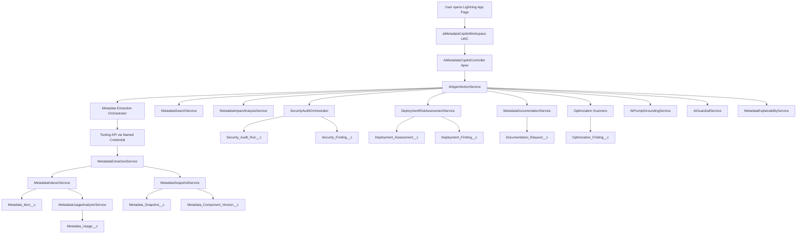

# AI Metadata Copilot for Salesforce Health Cloud

Salesforce-native internal AI copilot project for Health Cloud metadata search, impact analysis, security auditing, deployment comparison, documentation generation, and optimization scanning.

This project is designed for:
- Salesforce Admins
- Salesforce Developers
- Solution Architects
- Release Managers

It is built to stay inside the Salesforce ecosystem:
- Agentforce
- Prompt Builder
- Apex
- LWC
- Tooling API
- Named Credentials
- Einstein Trust Layer

No external AI providers are used.

## 1. What This Project Does

This project started as a simple metadata navigator and evolved into an enterprise pilot foundation for an AI Metadata Copilot.

The project can:
- refresh and index Salesforce metadata into custom objects
- find where fields and objects are used
- generate impact summaries
- run Health Cloud-oriented security audits
- compare metadata snapshots for deployment readiness
- generate simple grounded documentation
- run optimization scans for cleanup candidates

## 2. Current Project Structure

Project root:

```text
D:\Salesforce Metadata Navigator MVP
```

Main folders:
- `force-app/main/default/classes`
- `force-app/main/default/lwc`
- `force-app/main/default/objects`
- `docs`

Main config:
- [`sfdx-project.json`](D:\Salesforce%20Metadata%20Navigator%20MVP\sfdx-project.json)

## 3. End-to-End Flow



## 4. Beginner-Friendly Working Model

Think of the project in 6 layers:

1. Extraction layer
   Reads metadata from Salesforce Tooling API.

2. Indexing layer
   Stores metadata in custom objects so it can be queried later.

3. Dependency layer
   Creates usage relationships like:
   - Apex class uses field
   - flow uses object

4. Intelligence layer
   Searches metadata, calculates impact, and formats explainable responses.

5. Governance layer
   Runs security checks, deployment checks, documentation generation, and optimization scans.

6. Experience layer
   LWC workspace and Agentforce-facing Apex methods.

## 5. Custom Objects Created

### Existing MVP Objects

#### `Metadata_Item__c`
Purpose:
- stores one metadata component per row

Important fields:
- `Metadata_Key__c`
- `Metadata_Type__c`
- `Api_Name__c`
- `Developer_Name__c`
- `Object_API_Name__c`
- `Field_API_Name__c`
- `Source_Record_Id__c`
- `Namespace_Prefix__c`
- `Status__c`
- `Last_Indexed_On__c`

Use case:
- used as the main searchable metadata inventory

#### `Metadata_Usage__c`
Purpose:
- stores one dependency relationship per row

Important fields:
- `Usage_Key__c`
- `Source_Metadata__c`
- `Target_Metadata__c`
- `Source_Key__c`
- `Target_Key__c`
- `Usage_Type__c`
- `Source_Type__c`
- `Target_Type__c`
- `Match_Text__c`
- `Context_Snippet__c`
- `Last_Analyzed_On__c`

Use case:
- used for field usage and object usage search

#### `Impact_Assessment__c`
Purpose:
- stores impact search runs and summaries

Important fields:
- `Query_Text__c`
- `Query_Type__c`
- `Summary__c`
- `Impact_Level__c`
- `Match_Count__c`

Use case:
- used to persist impact analysis outputs

### New Enterprise Objects

#### `Metadata_Snapshot__c`
Purpose:
- stores each metadata extraction snapshot or environment snapshot

Key fields:
- `Snapshot_Key__c`
- `Snapshot_Type__c`
- `Source_Org_Label__c`
- `Target_Org_Label__c`
- `Status__c`
- `Started_On__c`
- `Completed_On__c`
- `Item_Count__c`
- `Summary__c`

#### `Metadata_Component_Version__c`
Purpose:
- stores one component’s state inside a snapshot

Key fields:
- `Version_Key__c`
- `Snapshot_Key__c`
- `Metadata_Key__c`
- `Metadata_Type__c`
- `Api_Name__c`
- `Checksum__c`
- `Source_Record_Id__c`
- `Definition_Snippet__c`

#### `Security_Audit_Run__c`
Purpose:
- one security audit execution

Key fields:
- `Run_Key__c`
- `Scope_Type__c`
- `Scope_Value__c`
- `Severity__c`
- `Summary__c`
- `Started_On__c`
- `Completed_On__c`
- `Finding_Count__c`

#### `Security_Finding__c`
Purpose:
- one security finding

Key fields:
- `Finding_Key__c`
- `Run_Key__c`
- `Finding_Type__c`
- `Severity__c`
- `Object_API_Name__c`
- `Field_API_Name__c`
- `Permission_Artifact__c`
- `Summary__c`
- `Recommendation__c`

#### `Deployment_Assessment__c`
Purpose:
- one deployment compare and risk analysis run

Key fields:
- `Assessment_Key__c`
- `Source_Environment__c`
- `Target_Environment__c`
- `Readiness_Score__c`
- `Severity__c`
- `Summary__c`
- `Rollback_Checklist__c`
- `Test_Checklist__c`

#### `Deployment_Finding__c`
Purpose:
- one deployment issue

Key fields:
- `Finding_Key__c`
- `Assessment_Key__c`
- `Finding_Type__c`
- `Severity__c`
- `Metadata_Key__c`
- `Summary__c`
- `Recommendation__c`

#### `Documentation_Request__c`
Purpose:
- stores generated metadata explanation outputs

Key fields:
- `Request_Key__c`
- `Request_Type__c`
- `Metadata_Key__c`
- `Technical_Summary__c`
- `Business_Summary__c`
- `Status__c`

#### `Optimization_Finding__c`
Purpose:
- stores optimization and cleanup issues

Key fields:
- `Finding_Key__c`
- `Finding_Type__c`
- `Severity__c`
- `Metadata_Key__c`
- `Summary__c`
- `Recommendation__c`
- `Status__c`

## 6. Custom Metadata Types Created

#### `Metadata_Type_Config__mdt`
Purpose:
- configures which metadata types are extracted and how

Fields:
- `Metadata_Type__c`
- `Query_Text__c`
- `Enabled__c`

#### `Sensitive_Field_Rule__mdt`
Purpose:
- marks sensitive Health Cloud objects and fields

Fields:
- `Object_API_Name__c`
- `Field_API_Name__c`
- `Sensitivity_Level__c`
- `Compliance_Note__c`

#### `Risk_Scoring_Rule__mdt`
Purpose:
- stores configurable scoring logic

Fields:
- `Rule_Category__c`
- `Weight__c`
- `Severity__c`

#### `Agent_Action_Config__mdt`
Purpose:
- controls AI action exposure and prompt mapping

Fields:
- `Action_Name__c`
- `Topic_Name__c`
- `Enabled__c`
- `Prompt_Template_Name__c`
- `Guardrail_Note__c`

#### `Environment_Connection__mdt`
Purpose:
- stores allowed environment comparison configuration

Fields:
- `Environment_Label__c`
- `Named_Credential__c`
- `Environment_Type__c`
- `Active__c`

## 7. Apex Classes Created and What They Do

### Original Metadata Core

#### `MetadataToolingApiClient`
Use:
- makes Tooling API callouts through a Named Credential

Why it exists:
- keeps HTTP logic separated from business logic

#### `MetadataExtractionService`
Use:
- extracts Apex classes, Flows, and Custom Fields

Why it exists:
- converts Tooling API data into a simple internal structure

Important note:
- it was adjusted to avoid the 100-callout governor limit by using bulk-safe summary extraction

#### `MetadataIndexerService`
Use:
- upserts extracted metadata into `Metadata_Item__c`

#### `MetadataUsageAnalyzerService`
Use:
- creates `Metadata_Usage__c` rows by matching metadata references

#### `MetadataSearchService`
Use:
- searches indexed usage for field usage and object usage

#### `MetadataImpactAnalysisService`
Use:
- converts search results into impact summaries

#### `MetadataNavigatorController`
Use:
- controller used by the original `metadataNavigator` LWC

### Enterprise AI Foundation

#### `AiMetadataCopilotModels`
Use:
- shared request/response DTO classes for all AI workflows

#### `MetadataSnapshotService`
Use:
- stores metadata snapshots and component versions

#### `MetadataNormalizationService`
Use:
- converts plain English questions into normalized request structures

#### `MetadataExplainabilityService`
Use:
- builds grounded explanations and recommendations

#### `MetadataExtractionOrchestrator`
Use:
- runs extraction, snapshot creation, indexing, and usage analysis in the right order

#### `AiPromptGroundingService`
Use:
- converts metadata findings into grounded AI-friendly context

#### `AiGuardrailService`
Use:
- blocks unsafe/destructive prompt intent

#### `AiResponseFormatter`
Use:
- converts counts into scores and severity labels

#### `SensitiveDataClassificationService`
Use:
- determines which Health Cloud objects/fields are sensitive

#### `FieldAccessAuditService`
Use:
- reads `FieldPermissions` for a field

#### `PermissionSetExposureService`
Use:
- creates security findings for permission sets

#### `ProfileExposureService`
Use:
- creates security findings for profile-owned access

#### `SharingRiskService`
Use:
- adds higher-level sharing risk warnings

#### `SecurityAuditOrchestrator`
Use:
- runs the full security audit and stores run/finding records

#### `EnvironmentSnapshotService`
Use:
- captures environment snapshots for compare use cases

#### `MetadataCompareService`
Use:
- compares metadata snapshots by checksum and presence

#### `DeploymentRiskAssessmentService`
Use:
- calculates deployment readiness and stores results

#### `RollbackChecklistService`
Use:
- generates rollback guidance

#### `RegressionTestRecommendationService`
Use:
- generates testing recommendations for impact and deployment

#### `MetadataDocumentationService`
Use:
- generates grounded documentation summaries

#### `ReleaseNoteGenerationService`
Use:
- specialized documentation generation for release notes

#### `UnusedMetadataScanner`
Use:
- identifies custom fields without detected incoming usage

#### `DuplicateFlowScanner`
Use:
- identifies possible duplicate flow names

#### `TriggerRiskScanner`
Use:
- identifies Apex that looks like trigger logic

#### `HardcodedIdScanner`
Use:
- identifies possible hardcoded IDs in Apex

#### `AiAgentActionService`
Use:
- main service layer used by the AI controller

Why it exists:
- one place to connect search, impact, security, deployment, documentation, and optimization services

#### `AiMetadataCopilotController`
Use:
- AuraEnabled controller for the new AI workspace

### Queueables

#### `MetadataRefreshQueueable`
Use:
- async refresh runner

#### `SecurityAuditQueueable`
Use:
- async security audit runner

#### `DeploymentCompareQueueable`
Use:
- async deployment compare runner

#### `OptimizationScanQueueable`
Use:
- async optimization scan runner

## 8. LWCs Created

#### `metadataNavigator`
Use:
- original MVP UI for refresh + field/object search

#### `aiMetadataCopilotWorkspace`
Use:
- new enterprise tabbed workspace

Tabs:
- Search Workspace
- Impact Analysis Workspace
- Security Audit Workspace
- Deployment Assistant Workspace
- Documentation Generator Workspace
- Optimization Scanner Workspace
- Admin Configuration Workspace

## 9. Step-by-Step How the Project Works

### A. Metadata Refresh

1. User clicks `Refresh Metadata Core`
2. LWC calls `AiMetadataCopilotController.refreshMetadataIndex`
3. Controller calls `MetadataExtractionOrchestrator`
4. Orchestrator extracts metadata
5. Snapshot is saved to `Metadata_Snapshot__c`
6. Component versions are saved to `Metadata_Component_Version__c`
7. Metadata items are upserted into `Metadata_Item__c`
8. Usage relationships are upserted into `Metadata_Usage__c`
9. UI shows snapshot key and counts

### B. Natural Language Search

1. User asks a question like:
   `Where is Patient_Status__c used?`
2. LWC sends the prompt to `AiMetadataCopilotController.searchMetadata`
3. `AiAgentActionService` normalizes the prompt
4. `MetadataSearchService` runs the actual search
5. `AiPromptGroundingService` converts raw rows into grounded AI result objects
6. `MetadataExplainabilityService` builds summary and explanation
7. LWC shows structured results

### C. Impact Analysis

1. User asks:
   `If I rename Contact.Email what breaks?`
2. Request goes through `AiAgentActionService.analyzeImpact`
3. Existing usage search is reused
4. Impact score and severity are calculated
5. Regression test suggestions are generated
6. `Impact_Assessment__c` persists the result
7. UI shows summary, severity, impacted components, and recommendations

### D. Security Audit

1. User asks:
   `Who can access Member__c sensitive fields?`
2. Prompt is normalized into object/field scope
3. Sensitive targets are loaded from `Sensitive_Field_Rule__mdt` or fallback rules
4. `FieldAccessAuditService` queries `FieldPermissions`
5. Permission set and profile exposure services create findings
6. Sharing risk service adds broad exposure warnings
7. Findings are saved into:
   - `Security_Audit_Run__c`
   - `Security_Finding__c`
8. UI shows grounded findings

### E. Deployment Assistant

1. User selects source and target environment
2. Controller calls deployment compare service
3. Snapshot versions are compared
4. Missing and changed metadata are identified
5. Readiness score is calculated
6. Rollback and test checklist are generated
7. Results are saved in deployment assessment objects

### F. Documentation Generator

1. User enters a metadata key
2. Documentation service loads indexed metadata
3. Technical summary is created
4. Business summary is created
5. Request is stored in `Documentation_Request__c`
6. UI shows grounded documentation

### G. Optimization Scanner

1. User runs the scan
2. Multiple scanners run:
   - unused metadata
   - duplicate flows
   - trigger risk
   - hardcoded IDs
3. Findings are stored in `Optimization_Finding__c`
4. UI shows results

## 10. Important Setup Still Needed in the Org

This repo contains the source, but some Salesforce configuration is still done in the org UI.

You still need:
- Lightning App Builder page setup for `aiMetadataCopilotWorkspace`
- Named Credential configuration for Tooling API
- `Sensitive_Field_Rule__mdt` records
- `Agent_Action_Config__mdt` records
- `Environment_Connection__mdt` records
- Prompt Builder assets
- Agentforce topics and actions
- Permission sets
- Test classes

## 11. How to Deploy to a Salesforce Org

Authorize org:

```powershell
sf org login web --alias health-mvp-dev --instance-url https://login.salesforce.com
```

Deploy:

```powershell
cd "D:\Salesforce Metadata Navigator MVP"
sf project deploy start --target-org health-mvp-dev --source-dir force-app
```

## 12. How to Add the LWC to Lightning App Builder

1. Open Salesforce
2. Click `Setup`
3. Search `Lightning App Builder`
4. Open `Lightning App Builder`
5. Create or edit an `App Page`
6. Drag `aiMetadataCopilotWorkspace` onto the page
7. Save
8. Activate

## 13. How to Put This on GitHub

### Step 1. Initialize git locally

```powershell
cd "D:\Salesforce Metadata Navigator MVP"
git init
git add .
git commit -m "Initial AI Metadata Copilot for Salesforce Health Cloud"
```

### Step 2. Create an empty GitHub repository

Use a repo name like:

```text
ai-metadata-copilot-salesforce-health-cloud
```

### Step 3. Add remote and push

```powershell
git branch -M main
git remote add origin https://github.com/KrishnenduBose-github/ai-metadata-copilot-salesforce-health-cloud.git
git push -u origin main
```

## 14. Recommended Team Workflow

Your teammates can:

```powershell
git clone https://github.com/KrishnenduBose-github/ai-metadata-copilot-salesforce-health-cloud.git
```

Then:

```powershell
git checkout -b feature/my-change
```

After changes:

```powershell
git add .
git commit -m "Describe change"
git push origin feature/my-change
```

Then open a Pull Request in GitHub.

## 15. Beginner Notes

If you are new to Salesforce, remember this:

- LWC is the UI
- Apex is the backend logic
- Custom Objects store results
- Custom Metadata Types store configuration
- Tooling API reads metadata
- Named Credentials make callouts safer
- Agentforce and Prompt Builder sit on top of this logic, not instead of it

The AI is only as good as the grounding data.

That means:
- refresh metadata often
- keep custom metadata configuration clean
- make AI answers point to real stored findings

## 16. Current Known Limitations

- Flow extraction is intentionally lighter now to avoid governor limit issues
- dependency analysis is still mostly text-based
- deployment comparison is snapshot-based, not true cross-org deep diff yet
- Prompt Builder and Agentforce assets are not source-authored in full here
- no test classes yet
- no packaged permission sets yet

## 17. Suggested Next Steps

1. Add test classes
2. Create sample custom metadata records
3. Wire Prompt Builder assets
4. Configure Agentforce topics/actions
5. Add permission sets
6. Improve dependency parsing depth
7. Harden deployment comparison

---

If you are handing this project to another beginner developer, tell them to start with:
- `AiMetadataCopilotController`
- `AiAgentActionService`
- `MetadataExtractionOrchestrator`
- `MetadataSearchService`
- `aiMetadataCopilotWorkspace`

Those 5 pieces explain most of the project flow.
